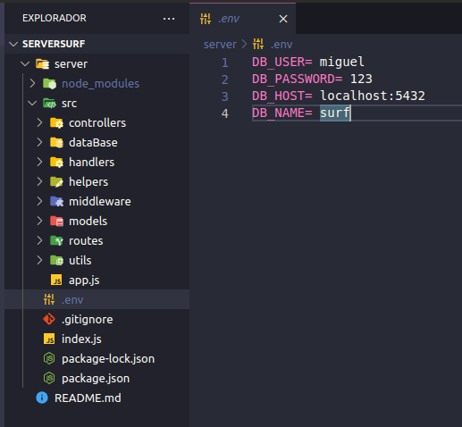
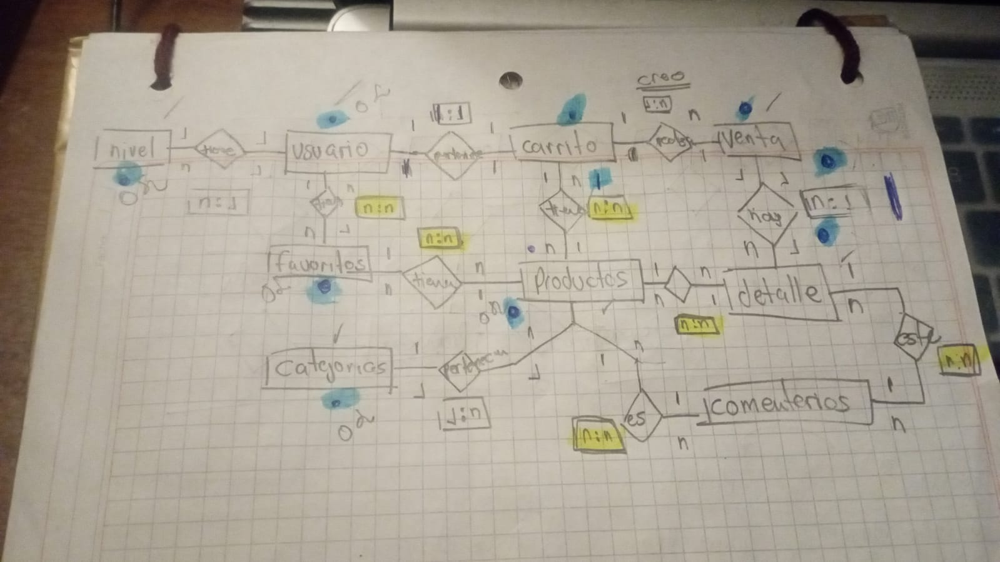

# ServerSurf
 
modelo E-R  
 

PASOS PARA UNA VENTA 
PRIMERO AGREGAR AL CARRITO 
{   
    "idUser":"1",
    "idProduct":"7",
    "amount": "2",
}

CREAR LA VENTA 
{   
    "idUser":"1",
    "costSale":"662.6"
}

AÑADIR AL DETALLE 
{   
    "idSale":"7", 
    "idUser":"1", 
    "listProducts": [1,2,5,7]
}

ELIMINAR EL CARRITO 
